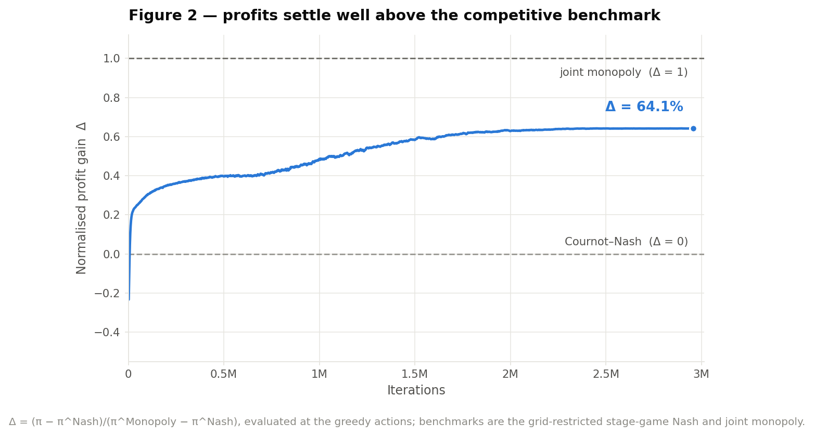
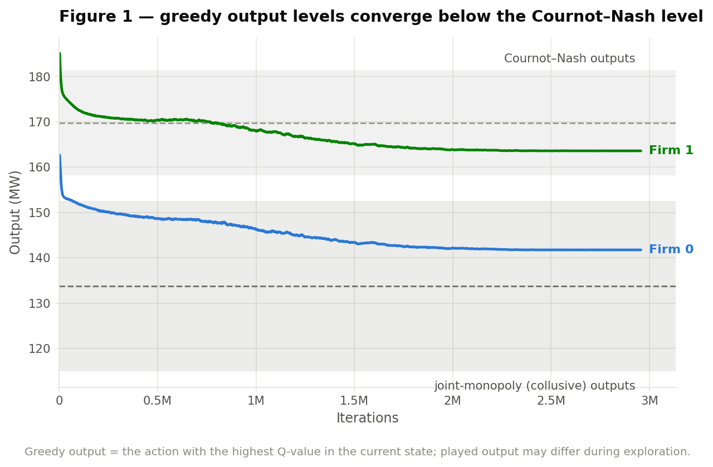
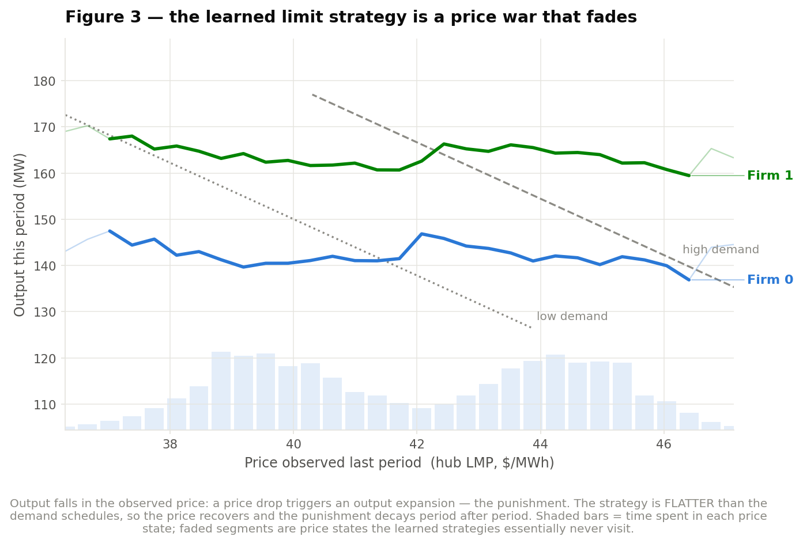
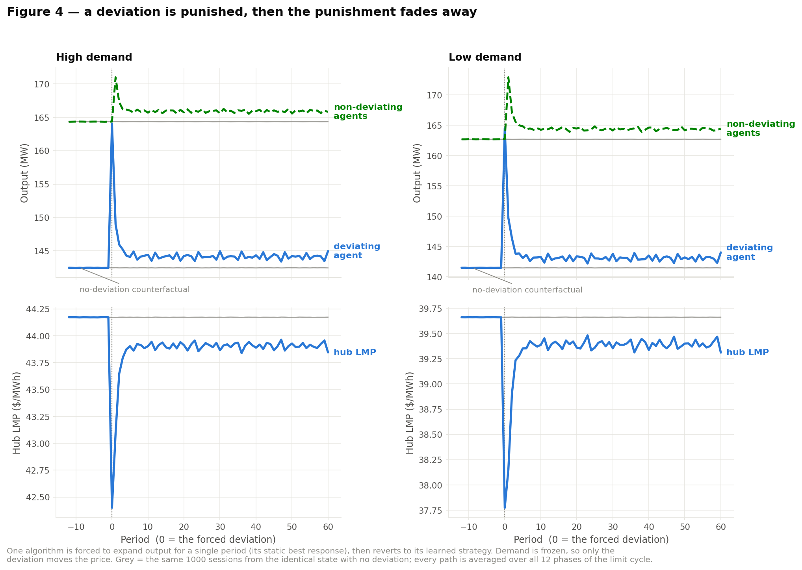
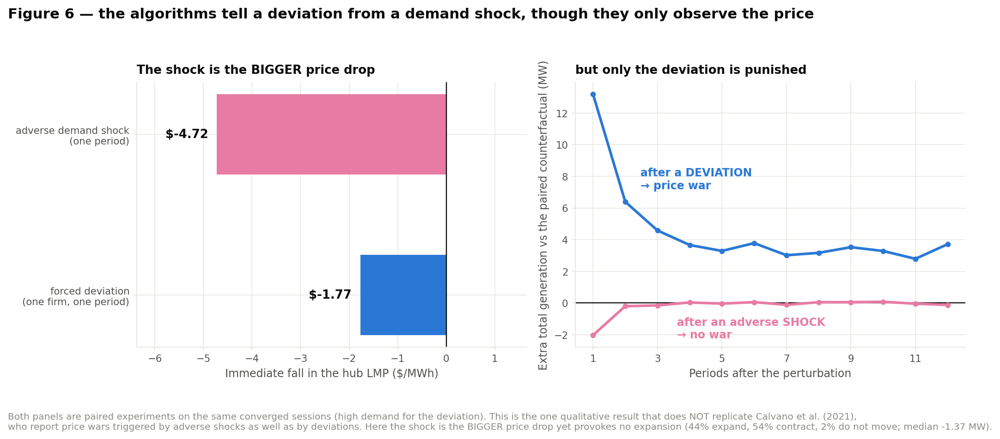

# Results — does Q-learning collude on the TWO-FIRM / THREE-PLANT market?

**Yes.** Tabular Q-learning with a discretised action space converges to
substantially supra-competitive profits on the two-firm market (Δ = **64.14%**),
and the strategies it converges to are genuinely collusive: deviations trigger
price wars that fade, the wars are harsher exactly where theory says they should
be, and cheating is unprofitable once the punishment is priced in.

This is the companion to [`RESULTS.md`](RESULTS.md) (three firms, one plant
each). It is also the **closer** of the two replications, for a structural
reason: Calvano–Calzolari–Denicolò–Pastorello (2021) study a **duopoly**, so this
market — not the three-firm one — is the direct counterpart of their headline
experiment. Every ordering in their Table I reproduces here.

Baseline experiment: **imperfect monitoring** (state = last period's hub LMP)
with **stochastic demand**, 1,000 independent sessions, `k = 15`, `α = 0.15`,
`β = 4×10⁻⁶`, `δ = 0.95`. **100% of sessions converged**, median at **2.10M
iterations**.

---

## 0. The market, and two things that had to be got right first

Firm 0 owns a cheap base unit at node 0 (cap 115, MC 10, QC 0.065) and an
expensive peaker at the node-1 hub (cap 125, MC 24, QC 0.050). Firm 1 owns one
mid-cost plant at the hub (cap 210, MC 17, QC 0.040). The repo's solvers
reproduce the benchmark tables exactly:

| | Competitive | Nash (LCP) | Monopoly |
|---|---|---|---|
| avg LMP ($/MWh) | 30.18 | 40.39 | 45.03 |
| total generation (MW) | 448.67 | 324.14 | 267.55 |
| total profit ($/step) | 4160.26 | 6294.89 | 7408.39 |
| per-plant (MW) | 115.0 / 123.67 / 210.0 | 53.79 / 107.0 / 163.36 | 115.0 / 0.0 / 152.55 |

Two structural problems had to be solved before any Q-learning could be run.
Both are specific to a firm that owns more than one plant, and both change the
answer, so they are worth stating plainly.

### 0a. How to discretise a firm that owns two plants

The Q-learning algorithm gives each agent **one scalar action**, but firm 0 has
two decision variables. The three candidate fixes are a 2-D product grid
(k² = 225 actions), a scalar total with a fixed internal split rule, or two
cooperative learners inside the firm. A fixed split rule is normally *unsafe*,
because it can put the Nash or the monopoly benchmark out of reach and so
corrupt the Δ denominator.

Here the scalar reduction is not merely safe, it is **exact**, for a reason
specific to this market: **no transmission line congests anywhere on the
relevant action range.** Measured over every grid profile × every demand state,
max |shadow price| = **2.9×10⁻⁶**. With no congestion the DC-OPF returns a single
uniform LMP, so firm 0's two plants are paid the *same* price; its internal
allocation problem loses its price-arbitrage motive and collapses to minimising
its own production cost. Measured directly, the best attainable gain from
re-splitting away from least-cost dispatch is

> **$1.2 × 10⁻¹¹ across all 225 profiles and every demand state** — i.e. zero.

So firm 0's action is its **total output** on a k-point grid, dispatched
internally by equalising marginal cost across its own plants. This keeps one
scalar action per agent exactly as in the paper, keeps |A_i| = 15 for both firms,
and loses nothing relative to a 2-D grid. It also reproduces both benchmark
splits exactly: least-cost dispatch of 115 MW gives (115, 0) = the monopoly
allocation, and of 158 MW gives (115, 43) = the Nash allocation. Cournot
simultaneity is preserved, because the split depends only on the firm's own
action, never on the rival's.

The resulting game is a very close structural match to the paper's baseline:

| | this market | paper's baseline |
|---|---|---|
| agents | 2 | 2 |
| actions per agent `k` | 15 | 15 |
| state space, perfect monitoring | k² = **225** | k² = **225** |
| price bins, imperfect monitoring | n(k−1)+m+1 = **37** | **37** |
| Nash at action index | **12** | 12 |
| monopoly at action index | **2** | 2 |
| non-revealing price fraction | **0.292** | closed form **0.304** |

For comparison, the three-firm market's non-revealing fraction was 0.384 against
a closed form of 0.568 — the duopoly matches the paper's monitoring structure far
more tightly.

### 0b. The paper's LCP Nash is **not an equilibrium** of this market

The repo's Nash benchmark is the networked-Cournot LCP of the source paper
(eqs. 39–45), in which each firm's stationarity condition uses the inverse-demand
slope of the node its plant sits on. That is correct when a firm's plants all sit
at one node — which is why it agrees with a direct best-response calculation on
the three-firm hub market.

It is **wrong here**, because firm 0 straddles two nodes. The LCP has firm 0
withhold at node 0 as though it were a local monopolist there (53.79 MW), but
node 0 is price-coupled to the rest of the network — the line never binds — so
that withholding buys nothing. At the LCP point:

> firm 0 raises its profit by **+25.2%** ($3,007.85 → $3,764.81) by unilaterally
> deviating.

The LCP point is a conjectural-variations equilibrium, not a Nash equilibrium of
the game the algorithms actually play. **Using it as the Δ denominator would
manufacture apparent collusion**: agents that merely learn to best-respond, with
no coordination whatsoever, would already score Δ > 0. That is precisely the
false positive the impossibility critique is about, so it had to be fixed.

Δ is therefore measured against the **true best-response Nash**, computed by
iterating exact best responses on the DC-OPF game:

| | plants (MW) | total | LMP | π firm 0 | π firm 1 | total π |
|---|---|---|---|---|---|---|
| Nash (LCP, paper's) | 53.79 / 107.0 / 163.36 | 324.14 | 40.39 | 3007.85 | 3286.96 | 6294.89 |
| **Nash (best-response)** | **115.0 / 43.19 / 181.41** | **339.60** | **39.12** | **3525.7** | **3355.0** | **6880.75** |
| joint monopoly | 115.0 / 0.0 / 152.55 | 267.55 | 45.03 | 3598.3 | 3810.0 | 7408.23 |

Both are reported side by side in `market_multi.describe()`; `nash_mode="lcp"`
reproduces the docx denominator instead.

---

## 1. Headline number

| | learned | best-response Nash | joint monopoly |
|---|---|---|---|
| **Δ (profit gain)** | **64.14%** ± 0.34 | 0% | 100% |
| total generation | 305.4 MW | 339.6 | 267.5 |
| hub LMP | $41.93 | $39.12 | $45.03 |
| firm outputs (MW) | 141.8 / 163.6 | 158.2 / 181.4 | 115.0 / 152.5 |

**Against the paper:** 64.14% here vs **76.25%** in their duopoly baseline.
Given that this market replaces a textbook `p = d − Σq` with a five-node DC-OPF
clear, quadratic costs, a capacity-constrained cheap base unit and a
multi-plant firm, landing 12 points under is a close replication — and §4
explains the gap exactly.



The trajectory has the paper's exact shape: Δ starts at **−0.233** — the
algorithms' first greedy policy is the best response to uniformly-randomising
rivals, which *over*-produces relative to Nash — then climbs through the learning
phase and plateaus once ε decays.



Greedy outputs start above the Nash band (162.7 / 185.1 MW), fall through it, and
settle at **141.8 / 163.6 MW** — well below Nash (158.2 / 181.4) and about
two-fifths of the way to monopoly (115.0 / 152.5).

### 1a. Read the per-firm Δ with care

Per-firm Δ = **222% / 39%**. This does **not** mean firm 0 is "more than fully
collusive". Δ normalises by that firm's own Nash→monopoly rent, and firm 0's is
tiny ($72.5), so the ratio is a high-variance statistic. The meaningful view is
absolute gains over Nash:

| | firm 0 gain | firm 1 gain | total | Δ |
|---|---|---|---|---|
| joint monopoly | +$72.5 | +$454.9 | 7408.2 | 1.000 |
| Nash bargaining solution | +$223.3 | +$293.3 | 7397.3 | 0.979 |
| **learned (Q-learning)** | **+$161.0** | **+$177.3** | 7219.1 | **0.641** |

The algorithms do **not** converge on the joint-profit-maximising point. They
converge on a near-**equal-absolute-gains** split of the collusive surplus
(+$161 / +$177), which is far more egalitarian than joint monopoly
(+$72.5 / +$455) — and it is egalitarian in exactly the direction that makes
firm 0's nearly-binding participation constraint slack. **The algorithms solve
the cartel's distribution problem, not just its aggregate one.** That is a
result the three-firm market (nearly symmetric firms) could not have shown.

---

## 2. The strategies are genuinely collusive

Supra-Nash profits alone prove nothing — the algorithms might simply have failed
to optimise. Three pieces of evidence say otherwise.

### 2a. The limit strategy is a Green–Porter price war (paper Figure 3)



Output is a **decreasing function of the price observed last period**: a price
drop triggers an output expansion — the punishment. And, exactly as in the paper,
**the strategy is much flatter than the demand schedules**:

| | MW per $/MWh |
|---|---|
| learned limit strategy, firm 0 | −0.24 |
| learned limit strategy, firm 1 | −0.33 |
| demand schedule (per firm) | **−6.1** |

That flatness is what makes the punishment self-terminating: because the response
is milder than the price move that provoked it, the price recovers, so next
period's punishment is milder still, and the market walks back to its resting
point. The algorithms use punishment *intensity* as a substitute for the clock
their one-period memory denies them — the paper's central mechanism, reproduced.

### 2b. Forced deviations get punished — harder when they can't hide (paper Figure 4)



One algorithm is forced into its static best response for a single period, then
reverts to its learned strategy; demand is frozen so only the deviation moves the
price. Averaged over all converged sessions and all 12 phases of the limit cycle,
the **rival's** output above the no-deviation counterfactual:

| punishment (MW) | t+1 | t+2 | t+3 | t+4 | t+5 |
|---|---|---|---|---|---|
| **high demand** | +6.65 | +2.91 | +1.85 | +1.83 | +1.65 |
| **low demand** | +10.23 | +4.38 | +2.86 | +2.29 | +2.14 |

Two things to read off this.

**The punishment is harsher in low demand (+10.23 MW) than in high demand
(+6.65 MW).** This is the paper's signature asymmetry and the fingerprint of
*imperfect monitoring specifically*: in the high state a low price might be an
adverse demand shock rather than a cheat, so the algorithms punish more
cautiously; in the low state there is no such ambiguity.

**The price war decays fast, then leaves a residue.** ~72% of the punishment is
gone within three periods — the "harsher initially, then gradually fading" shape
the paper describes. But it does not return all the way. Decomposing by whether a
session returns to its exact pre-deviation cycle:

| | returns to its cycle | residue of those | residue of the rest |
|---|---|---|---|
| high demand | **78.7%** | +0.36 MW | +7.32 MW |
| low demand | **86.7%** | +0.58 MW | +14.22 MW |

With demand frozen and the limit strategies deterministic, post-convergence play
is a deterministic map on 37 price states, so each session settles into a cycle;
a single deviation can tip it into a *different* absorbing cycle and nothing
brings it back. **A one-off deviation permanently destroys the cartel in 21.3% of
sessions in high demand and 13.3% in low demand.** The paper's Figure 4 shape
is what the other ~80–87% do.

### 2c. Cheating is unprofitable once the punishment is priced in

The direct incentive-compatibility test. For each converged session, run two
paths from the identical state — one with the forced deviation, one without — and
compare discounted payoff streams at δ = 0.95:

| | one-period gain | discounted total | deterred |
|---|---|---|---|
| **low demand** | +$23 | **−$457** | **76.1%** of sessions |
| **high demand** | +$122 | **−$91** | **42.2%** of sessions |

In both states the pattern is textbook collusion: cheating pays today and loses
over the punishment phase. In the low state it is deterred in three quarters of
sessions.

In the high state deterrence is **much weaker**. That is not a defect of the
replication; it is imperfect monitoring doing exactly what the theory says. High
demand is precisely the state where a deviation can hide behind a possible
adverse shock, so the equilibrium punishment is softer and the deviation
constraint nearly binds.

Deterrence is also **not size-dependent** — sweeping the forced deviation from 1
to 8 grid steps leaves it flat:

| deviation size | +1 | +2 | +4 | +6 | +8 |
|---|---|---|---|---|---|
| deterred, high demand | 53.0% | 48.8% | 44.6% | 43.4% | 43.1% |
| deterred, low demand | 73.0% | 73.2% | 72.5% | 74.3% | 74.7% |

### 2d. But shocks do NOT trigger price wars — the one thing that differs



The paper reports that price wars are triggered **both** by deviations **and** by
adverse demand shocks. Here they are triggered by deviations only.

Paired experiment: the same converged sessions run twice from the identical
state; one copy gets the adverse demand draw at period 0, the other the
favourable one; from period 1 on both get the *identical* shock sequence.

| perturbation | immediate price drop | total-gen response at t+1 |
|---|---|---|
| forced deviation | −$1.77 | **+13.19 MW** |
| adverse demand shock | **−$4.72** | **−2.03 MW**, median **−1.37 MW** |

The shock is the *bigger* price drop and produces no war: 44.1% of sessions
expand, 53.5% contract, 2.4% do not move. So the learned strategy is sharper than
the paper's smooth reaction function — a **trigger**: flat over the price band
ordinary demand noise moves it within, steep once the price falls below that
band. The algorithms have partially learned to filter the shock out of the
signal.

This is the same single non-replication as in the three-firm market, and it
reproduces there for the same reason: the DC-OPF price lattice does not collide
as cleanly as `p = d − Q`, so the two demand branches are more separable and the
algorithms *can* tell shocks from deviations. **Testable prediction:** raise `h`
(the paper's §5.6 uses h = 5) or raise `m` and the shock-triggered war should
reappear. Not yet run.

---

## 3. Table I — the impact of imperfect monitoring

| | Deterministic demand | Stochastic demand |
|---|---|---|
| **Perfect monitoring** | 78.51% | 70.03% |
| **Imperfect monitoring** | **85.41%** | **64.14%** |

Difference-in-differences (the pure imperfect-monitoring effect):
**−12.79 pp** (paper: −8.91 pp).

Side by side with the paper and with the three-firm market:

| cell | 2-firm / 3-plant | 3-firm hub | paper (duopoly) |
|---|---|---|---|
| imperfect + stochastic | **64.14%** | 68.78% | 76.25% |
| imperfect + deterministic | **85.41%** | 84.18% | 89.60% |
| perfect + stochastic | **70.03%** | 78.98% | 79.72% |
| perfect + deterministic | **78.51%** | 78.88% | 84.16% |
| difference-in-differences | **−12.79 pp** | −15.50 pp | −8.91 pp |

**All four of the paper's qualitative findings replicate, and the two-firm market
tracks the paper more closely than the three-firm one does:**

1. **Imperfect + deterministic is the highest cell (85.41%)** — higher than
   perfect monitoring. This is the paper's own counter-intuitive result: when
   the state is the price rather than the rivals' output profile, the Q-matrix is
   far smaller (37 vs 225 states here), so the same β buys much more effective
   experimentation, and simpler strategies coordinate more easily.
2. **Imperfect + stochastic is the lowest cell (64.14%).** Confounding shocks
   with deviations is costly.
3. **The DiD is negative and appreciable.** Imperfect monitoring hinders
   collusion but does not prevent it — 64.1% is still deep collusion.
4. **Demand uncertainty costs ~8.5 pp under perfect monitoring** (78.51 → 70.03),
   in line with the paper's ~4.4 pp. This is the cell the three-firm market got
   *wrong*: there, uncertainty cost essentially nothing (78.88 → 78.98), which
   inflated its DiD to −15.50 pp. With n = 2 matching the paper's duopoly, the
   effect appears at the right sign and a plausible magnitude, and the DiD lands
   between the three-firm result and the paper's.

---

## 4. Why 64% here and 69% there — the asymmetric-ownership result

The two-firm market colludes *less* than the three-firm one, and the reason is
economically clean rather than numerical. Compare the cartel's incentives at
joint monopoly:

| | rent from colluding | one-shot cheat gain | δ\* |
|---|---|---|---|
| **2-firm**, firm 0 (2 plants) | **+$72.5 (+2.1%)** | +$314.1 | **0.8124** |
| **2-firm**, firm 1 | +$454.9 (+13.6%) | +$204.1 | 0.3097 |
| 3-firm, firm 0 | +$428.9 (+24.1%) | +$414.8 | 0.4916 |
| 3-firm, firm 1 | +$451.1 (+25.2%) | +$412.4 | 0.4776 |
| 3-firm, firm 2 | +$422.5 (+23.7%) | +$417.1 | 0.4968 |

Firm 0 is a **reluctant cartel member**. Its cheap base unit is already at its
capacity (115 MW) at *both* Nash and monopoly, so its marginal unit is the
expensive peaker. Collusion therefore asks firm 0 to make the larger output cut
(43 MW, vs 29 MW for firm 1) while handing it almost none of the gain (+2.1%,
vs +13.6%). Its critical discount factor is **0.81** — collusion is sustainable
at δ = 0.95, but with far less slack than anything in the three-firm market
(δ\* ≈ 0.48–0.50).

Two consequences, both visible in the results:

- **The total rent is small.** Nash→monopoly is only **+7.7%** of Nash profit
  here, against +22.5% in the three-firm market. Δ is a share of a much narrower
  band, so the same absolute coordination failure costs more Δ points.
- **The joint-monopoly point is nearly non-viable**, so the algorithms go
  somewhere else — the near-equal-gains split of §1a. Δ = 64% partly measures
  *distance from a target the cartel would not have chosen anyway.*

This is the substantive economic finding of the two-firm case: **asymmetric
ownership — specifically, a multi-plant firm whose cheap capacity is already
maxed out — weakens tacit collusion**, because the firm that must cut the most
gains the least, and no side payments are available to fix it.

---

## 5. Bearing on the impossibility result

The impossibility argument is about a **continuous** action space. This
experiment is the discrete counterpart on the same market, and it does not
contradict that argument — it brackets it. On this topology, with actions
restricted to 15 grid points per firm, Q-learning finds and sustains collusion
with punishments (Δ ≈ 64%). Any claim that the continuous-action PPO results are
or are not "collusion" now has a like-for-like discrete benchmark **on both
market structures** to be measured against.

Two points make the benchmark tighter here than in the three-firm case:

- **The grid is not doing the work by accident.** The action grid is centred on
  `[q^M_i, q^N_i]` extended by ξ = 0.2, which places Nash at action index 12 and
  joint monopoly at index 2 — the same positions they occupy in the paper's
  `{70, 72½, …, 105}` grid.
- **The 1-D reduction of the two-plant firm is exact, not an approximation**
  (§0a), so the discrete agent is choosing over the same economic decision the
  continuous PPO agent does. The discrete-vs-continuous comparison is not
  confounded by a restricted action set.

And §0b is a caution that applies to the PPO side too: **on this market, beating
the LCP Nash is not evidence of collusion.** Any agent that best-responds beats
it by 25%. Collusion claims here must be measured against the best-response Nash.

---

## 6. Honest caveats

- **Δ's denominator is narrow.** The Nash→monopoly rent is $527.5 (7.7%). Δ is
  well-defined and the standard error is small (±0.34), but a given Δ here
  corresponds to a much smaller dollar amount than in the three-firm market.
- **Per-firm Δ is not comparable across firms** in this market (§1a); firm 0's
  denominator is $72.5. Use absolute gains over Nash.
- **The joint-monopoly point is not what the algorithms aim at**, so Δ should be
  read as "share of the Nash→monopoly band captured", not as "fraction of the way
  to the outcome a cartel would negotiate". Against the Nash bargaining solution
  the learned point captures 65.5% of the attainable surplus.
- **Figure 6 does not replicate** (§2d) — shocks do not trigger wars here. Same
  as the three-firm case, with a testable proposed fix.
- **No congestion** anywhere on the action grid. That is what makes the 1-D
  reduction exact, but it also means this market exercises *market power*
  without exercising *network* effects. A tighter line-limit variant would test
  whether the reduction still holds; it would not, and firm 0 would then need the
  2-D action grid.

---

## Reproducing

```bash
export MARKET_CONFIG=two_firm
python -m qlearning_collusion.market_multi          # the discretised game + benchmarks
python -m qlearning_collusion.run table1            # all four cells (~1.5 h)
python -m qlearning_collusion.run figures           # Figures 1-4
python -m qlearning_collusion.fig6_deviation_vs_shock
python -m qlearning_collusion.compare_markets       # side-by-side vs 3-firm + paper
```

Raw artefacts are in `results_two_firm/` (`.npz` = learned policies +
trajectories, `.json` = summary, `.log` = training console output); figures in
`figures_two_firm/`. The three-firm artefacts in `results/` and `figures/` are
untouched — the profile-index refactor was regression-tested to reproduce them
bit-for-bit (grid Nash 328.6 MW, monopoly 232.6 MW, non-revealing 0.384).
